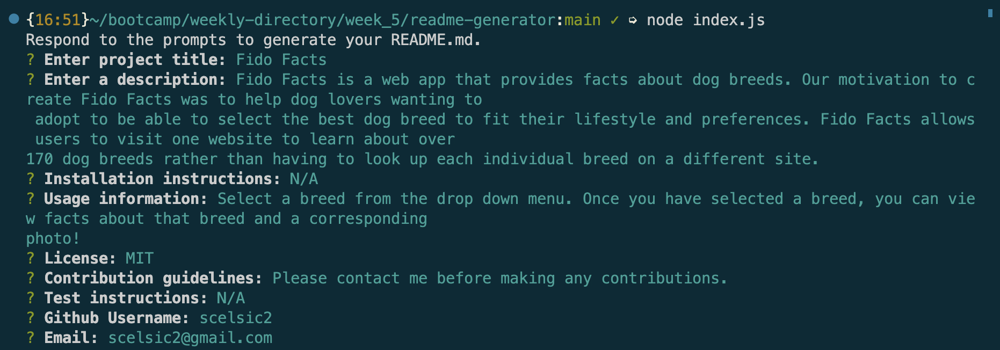
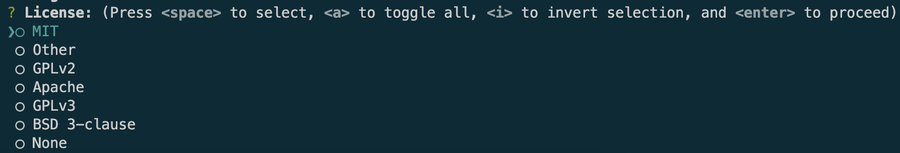
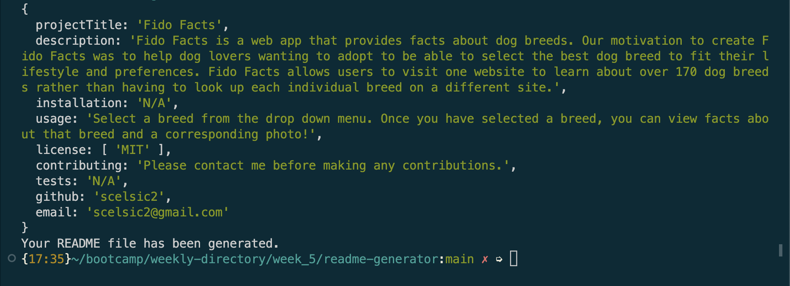
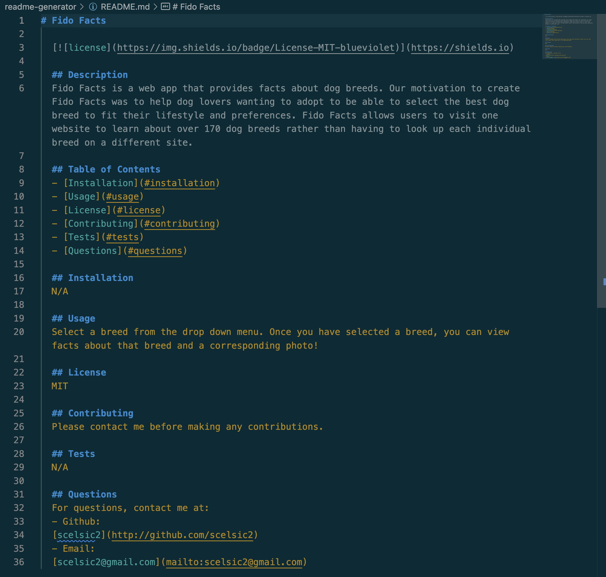
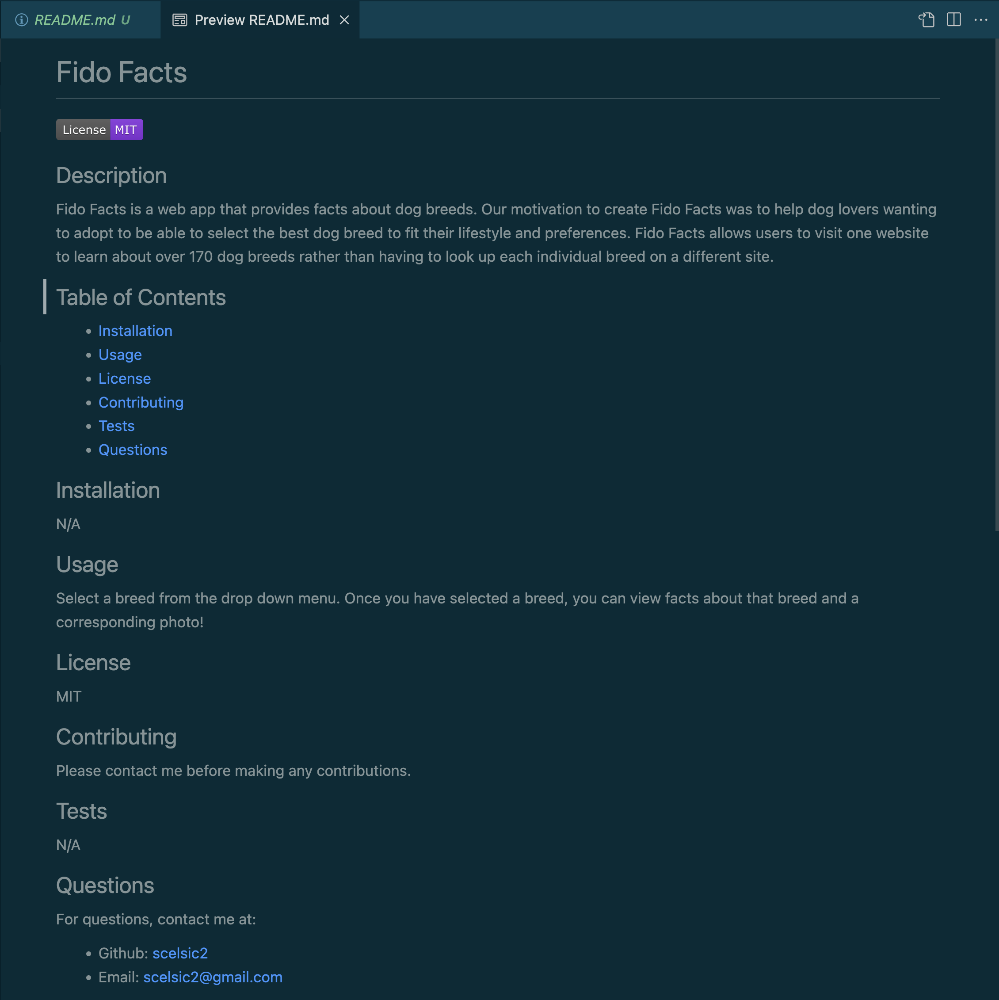

# README Generator

## Description

The README Generator creates a high-quality README.md file via user responses to prompts.

## Installation

1. Install [Node.js](https://nodejs.org/en).

2. Clone or fork the [repo](https://github.com/scelsic2/readme-generator).

3. Open the repo with VS Code.

4. Open an integrated terminal for the repo folder.

5. In the terminal, run `npm init`.

6. In the terminal, run `npm install inquirer`.  See documentation [here](https://www.npmjs.com/package/inquirer/v/8.2.4).

## Usage

Run `node index.js` in the terminal to begin.  Answer each prompt, and you can view the prompts and your responses in the terminal.

The program allows you to select from a list of license options.

The program creates an object of your responses and generates a README.md file.

Click on the newly-generated README.md to view the file in markdown.

Preview the README to see a more readable version.

View a video of the [README Generator](https://drive.google.com/file/d/1ZwW_J1tNQrRAyd2lpLEyPTyTjrDiZgKp/view?usp=share_link).

## Credits

- https://www.digitalocean.com/community/tutorials/nodejs-interactive-command-line-prompts
- https://www.youtube.com/watch?v=2VUQABoFOqw
- https://github.blog/2015-03-09-open-source-license-usage-on-github-com/
- https://www.youtube.com/watch?v=o8hkjz1TQuQ
- https://www.digitalocean.com/community/tutorials/understanding-template-literals-in-javascript
- https://gist.github.com/lukas-h/2a5d00690736b4c3a7ba
- https://shields.io

## License

MIT License